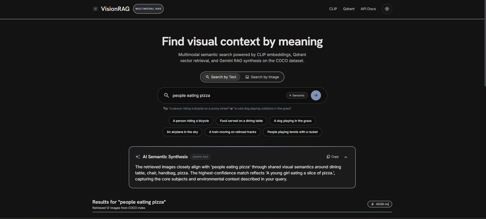
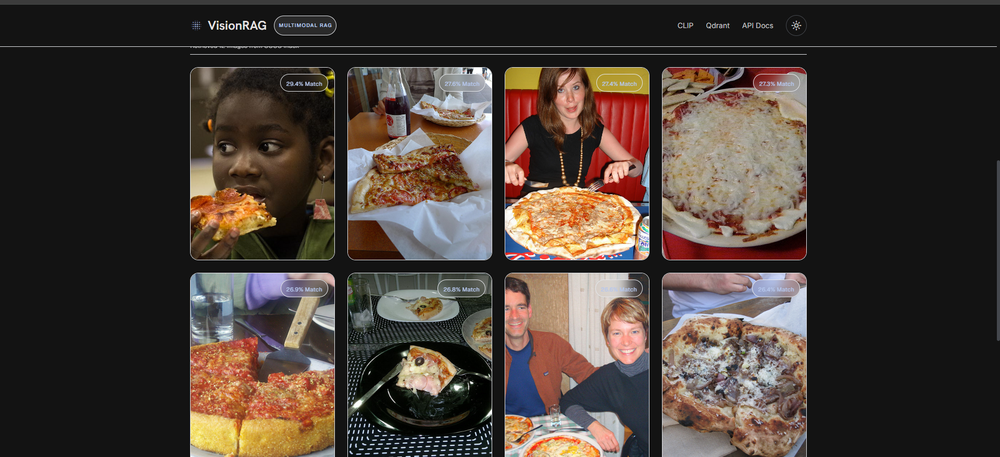
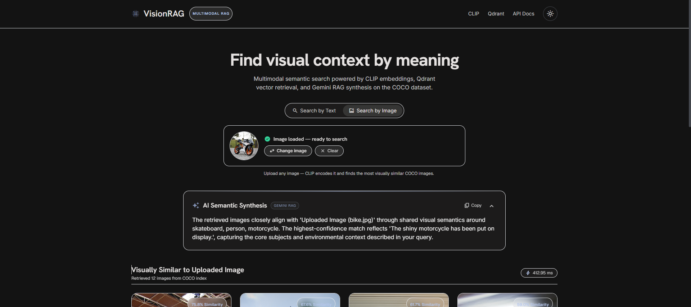
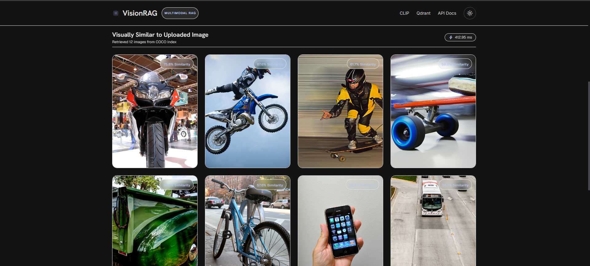

# VisionRAG 

**VisionRAG** is a multimodal image search and RAG project that lets you search a collection of images using either **text or another image**.

It uses **CLIP** to understand the relationship between text and images, **Qdrant** to find the most similar images, and **Google Gemini** to generate explanations based on the retrieved results.

Basically:

> **Search with words. Search with images. Get results that actually make sense.**

---

## 📸 Demo

### Text-to-Image Search






### Image-to-Image Search






---

##  What can VisionRAG do?

### Text → Image Search

Enter something like:

```text
a person riding a bicycle
```

VisionRAG converts the text into a CLIP embedding and searches the image collection for the closest matches.

The results are then passed through the RAG pipeline to provide an AI-generated explanation of why the retrieved images are relevant.

### Image → Image Search

Upload an image and VisionRAG finds visually similar images from the indexed dataset.

The uploaded image is converted into a CLIP image embedding and searched against the same Qdrant collection used for text search.

The retrieved images can also be explained using the same AI/RAG pipeline.

---

##  How it works

VisionRAG uses the same CLIP embedding space for both text and images.

### Text Search

```text
Text Query
    ↓
CLIP Text Encoder
    ↓
512-dimensional embedding
    ↓
Qdrant similarity search
    ↓
Top-K matching images
    ↓
COCO captions + categories
    ↓
Gemini
    ↓
AI explanation
```

### Image Search

```text
Uploaded Image
    ↓
CLIP Image Encoder
    ↓
512-dimensional embedding
    ↓
Qdrant similarity search
    ↓
Top-K similar images
    ↓
COCO captions + categories
    ↓
Gemini
    ↓
AI explanation
```

This means both search modes ultimately use the **same retrieval and RAG pipeline**.

---

## Why RAG?

The project isn't just sending a query to an LLM and asking it to make something up.

The process is:

1. **Retrieve** relevant images using CLIP + Qdrant.
2. **Augment** the results with information from the COCO dataset, such as captions and categories.
3. **Generate** an explanation using Gemini based on that retrieved information.

This gives the LLM actual retrieved context to work with instead of relying only on its general knowledge.

---

## Tech Stack

| Part | Technology |
|---|---|
| Frontend | React 18, JavaScript, Vite, Tailwind CSS |
| Backend | Python, FastAPI, Pydantic |
| Image/Text Embeddings | CLIP (`openai/clip-vit-base-patch32`) |
| Vector Database | Qdrant |
| LLM | Google Gemini |
| Dataset | COCO 2017 Validation Set |
| Frontend Tooling | Node.js, npm |

> **Note:** Node.js is only used for the React/Vite frontend tooling. The backend itself is written in **Python + FastAPI**.

---

## 📂 Project Structure

```text
VisionRAG/
│
├── backend/
│   ├── app/
│   │   ├── api/
│   │   │   └── routes/
│   │   ├── core/
│   │   ├── schemas/
│   │   ├── services/
│   │   │   ├── embedding/
│   │   │   ├── vector_store/
│   │   │   └── gemini/
│   │   └── main.py
│   ├── tests/
│   └── pyproject.toml
│
├── frontend/
│   ├── src/
│   │   ├── components/
│   │   ├── hooks/
│   │   └── api/
│   ├── package.json
│   └── vite.config.js
│
├── scripts/
│   ├── download_coco.py
│   ├── ingest.py
│   └── eval.py
│
├── data/
├── qdrant_local_data/
├── docker-compose.yml
├── .gitignore
└── README.md
```

---

##  Getting Started

### 1. Clone the repository

```bash
git clone https://github.com/shrvtiprasad/VisionRAG.git
cd VisionRAG
```

---

### 2. Set up the backend

```bash
cd backend
python -m venv .venv
```

Activate the virtual environment.

**Windows:**

```bash
.venv\Scripts\activate
```

**Linux/macOS:**

```bash
source .venv/bin/activate
```

Install PyTorch:

**CPU:**

```bash
pip install torch torchvision --index-url https://download.pytorch.org/whl/cpu
```

Then install the project dependencies:

```bash
pip install -e .
```

---

### 3. Add your Gemini API key

Create a `.env` file inside `backend/`:

```env
GEMINI_API_KEY=your_api_key_here
```

The API key is used for the AI explanation part of the application.

---

### 4. Download the dataset

For a quick setup, VisionRAG can work with a smaller subset of COCO:

```bash
cd ..
python scripts/download_coco.py --limit 500
```

Then generate the CLIP embeddings and index the images in Qdrant:

```bash
python scripts/ingest.py --limit 500 --batch-size 32
```

The full COCO 2017 validation set contains around **5,000 images**, but using 500 images makes it much easier to get started locally.

The dataset and Qdrant files are kept out of Git using `.gitignore`.

---

##  Running the Project

### Backend

Open a terminal:

```bash
cd backend
.venv\Scripts\activate
uvicorn app.main:app --reload --port 8000
```

Backend:

```text
http://localhost:8000
```

FastAPI docs:

```text
http://localhost:8000/docs
```

### Frontend

Open another terminal:

```bash
cd frontend
npm install
npm run dev
```

Frontend:

```text
http://localhost:5173
```

---

## 🔌 API

The backend currently exposes endpoints for:

| Endpoint | Purpose |
|---|---|
| `GET /health` | Check backend status |
| `POST /search` | Text-to-image search |
| `POST /find-similar` | Image-to-image search |
| `POST /find-similar/{image_id}` | Find similar indexed images |
| `POST /explain` | Generate an AI explanation |

You can explore and test the API directly through the FastAPI Swagger UI:

```text
http://localhost:8000/docs
```

---

## 📊 Evaluation

A small evaluation script is included to test retrieval quality and latency:

```bash
python scripts/eval.py
```

This can be used to compare retrieval results across different queries and measure how quickly the system responds.

---

##  Main Ideas Behind the Project

### Shared Text + Image Embedding Space

CLIP allows text and images to be represented in the same embedding space. This is what makes both text-based search and image-based search possible using the same vector database.

### Semantic Search

Instead of matching filenames or keywords, VisionRAG searches based on **visual and semantic similarity**.

### Vector Search

Qdrant stores the CLIP embeddings and performs cosine-similarity searches to retrieve the closest matches.

### Grounded AI Explanations

Gemini receives the retrieved dataset information as context and generates explanations based on those results.

---

## 📌 Current Features

- 🔤 Text-to-image semantic search
- 🖼️ Image-to-image similarity search
- 🧠 CLIP-based multimodal embeddings
- 🔍 Qdrant vector similarity search
- 🤖 Gemini-powered AI explanations
- 📚 COCO captions and category metadata
- ⚡ FastAPI backend
- ⚛️ React frontend
- 📊 Retrieval evaluation
- 💾 Local Qdrant storage
- 🐳 Optional Docker setup

---

## 📄 License

This project is licensed under the MIT License.
